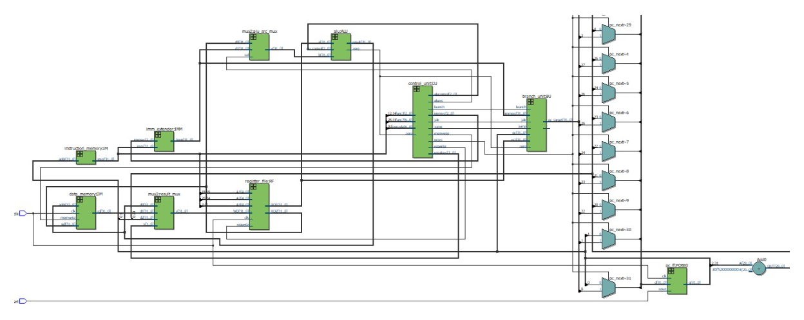
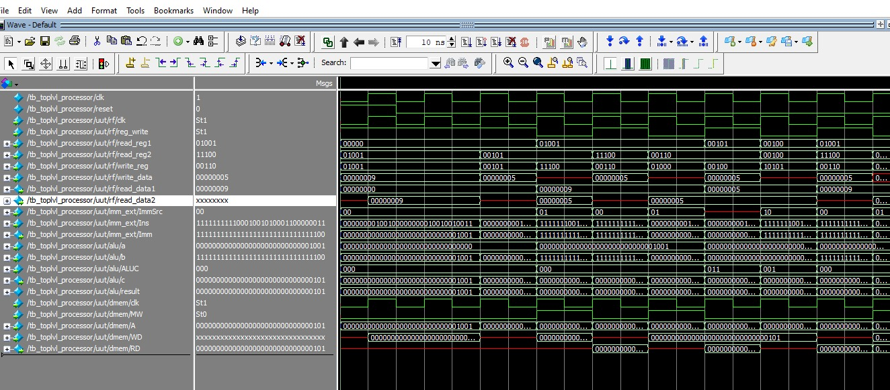

# Single-Cycle RISC-V Processor (RV32I)

## Abstract

This project presents the design, implementation, and verification of a **Single-Cycle RISC-V Processor** using SystemVerilog. The processor executes **one instruction per clock cycle**, covering all five major stages: Instruction Fetch (IF), Instruction Decode (ID), Execute (EX), Memory Access (MEM), and Write Back (WB). The design follows the **RV32I base integer instruction set**, including arithmetic, logical, branch, memory access, and jump instructions.

All functional blocks — **ALU, Control Unit, Register File, Immediate Extender, and Data Memory** — were designed as separate SystemVerilog modules for modularity, reusability, and clarity. Simulation and verification were carried out using **ModelSim**, and synthesis was performed in **Intel Quartus Prime**.

---

## Introduction

Modern processors adopt two main philosophies: **CISC** and **RISC**. RISC-V is a free and open-source ISA that embodies the simplicity and efficiency of RISC design. Key advantages of RISC-V include:

* Modular ISA supporting extensions (integer, floating-point, atomic, etc.).
* Open access for academic, research, and commercial use.
* Scalability for both microcontrollers and high-performance CPUs.

This project implements a **single-cycle CPU**, executing each instruction within one clock cycle, which simplifies control and datapath logic but limits clock frequency compared to pipelined designs.

---

## Objectives

1. Implement a functional single-cycle RISC-V processor using SystemVerilog.
2. Design and integrate functional modules including Control Logic, ALU, and Memory blocks.
3. Execute a subset of **RV32I instructions** accurately.
4. Simulate, verify, and synthesize the design using **ModelSim** and **Quartus Prime**.
5. Build a modular foundation for further enhancements like pipelining and cache integration.

---

## System Architecture

The processor executes the following stages per clock cycle:

1. **Instruction Fetch (IF):** Fetch instruction from instruction memory using the Program Counter (PC).
2. **Instruction Decode (ID):** Decode opcode and generate control signals.
3. **Execution (EX):** Perform ALU operations or calculate branch targets.
4. **Memory Access (MEM):** Read/write from/to data memory if required.
5. **Write Back (WB):** Write results back to the register file.

### Main Modules

* **Program Counter (PC):** Holds current instruction address, updates every clock.
* **Instruction Memory:** Stores machine code instructions.
* **Immediate Extender:** Extracts and extends immediate fields.
* **Register File:** 32 registers × 32 bits, 2 read ports, 1 write port.
* **ALU & ALU Decoder:** Executes arithmetic and logical operations.
* **Control Unit:** Generates control signals based on opcode.
* **Data Memory:** Byte-addressable memory for load/store instructions.
* **Multiplexers:** Select input for ALU or write-back path.
* **Branch Unit:** Calculates next PC, supports branch/jump instructions.
* **Pipeline Registers:** For future pipelined extensions.

---

## Verification & Simulation

The processor was **verified using a SystemVerilog testbench** in ModelSim. Waveform simulations were used to monitor:

* Correct instruction fetch, decode, execution, memory access, and write-back operations.
* ALU operation results and zero flags.
* Register file writes and data memory accesses.
* Correct branch and jump behavior.

The testbench ensured all RV32I instruction types executed correctly, confirming functional accuracy before hardware implementation.

---

## Hardware Testing

The design was synthesized and tested on the **Intel Cyclone V GX Starter Kit**. The hardware test validated correct instruction execution, memory reads/writes, and branching logic, demonstrating the processor’s operational feasibility on FPGA.

---

---

## References

* **Computer Organization and Design: RISC-V Edition**, Patterson & Hennessy
* RISC-V ISA Specification: [https://riscv.org](https://riscv.org)
* Intel Quartus Prime Documentation

---

